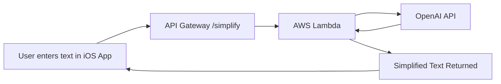

# Simplify

**Simplify** is an iOS app and backend service that makes text easier to read for people with developmental language disorder (DLD), cognitive challenges, or anyone who prefers simpler language. It uses AI to automatically rewrite complex sentences into short, clear, and accessible text. The app also lets users capture a textual image and simplify the text.

## Features

* **Inclusive Design** — focused on accessibility and supporting people with DLD.
* **Text Simplification** — converts complex text into short sentences with simple words.
* **iOS App (SwiftUI)** — clean, user-friendly interface for pasting or typing text.
* **AWS Lambda Backend** — lightweight serverless function that calls the OpenAI API.
* **API Integration** — securely uses API keys stored in AWS environment variables.

## Screenshot


## How It Works



1. User enters or pastes text in the iOS app.
2. App sends the text to the backend (`/simplify` endpoint).
3. AWS Lambda processes the request and calls OpenAI with accessibility-focused prompts.
4. The simplified version is returned and displayed in the app.

## Tech Stack

* **Frontend:** iOS app (SwiftUI)
* **Backend:** AWS Lambda (Python 3.12, `urllib`)
* **AI Model:** OpenAI GPT (accessibility-focused system prompt)
* **Infrastructure:** API Gateway + AWS Lambda

## Setup

### Backend (AWS Lambda)

Backend code is written in Python, hosted using AWS Lambda and API Gateway 

### Frontend (iOS App)

1. Clone the repo:

   ```bash
   git clone https://github.com/malihanawshin/Simplify.git
   cd Simplify
   ```
2. Open `Simplify.xcodeproj` in Xcode.
3. Update `BASE_URL` in your networking code with your API Gateway endpoint.
4. Run the app on simulator or device.

## Future Improvements

* Multi-language support.
* Adjustable simplification levels (basic, moderate, detailed).
* Voice input and text-to-speech output.
* Offline mode with on-device models.

## Contributing

Contributions are welcome! Feel free to fork the repo and submit pull requests.

## License

This project is licensed under the MIT License.
